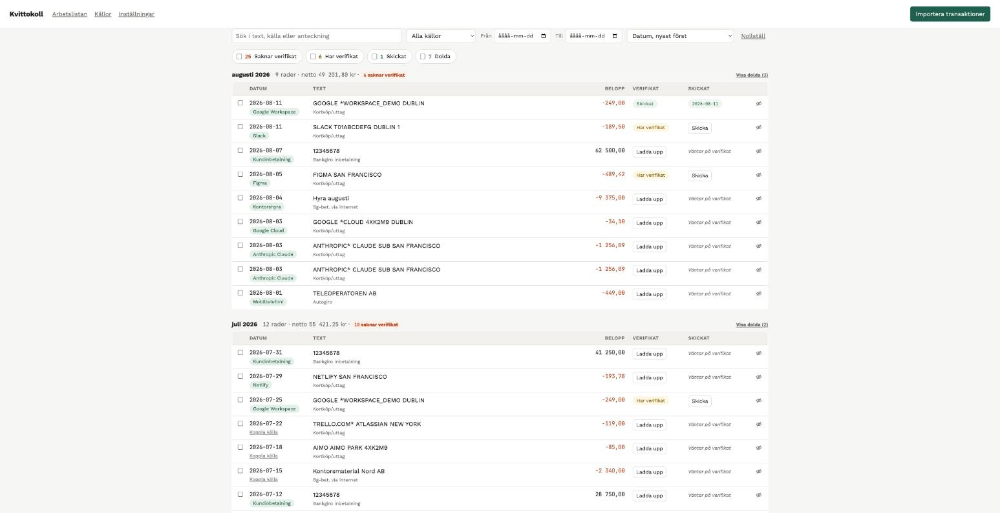
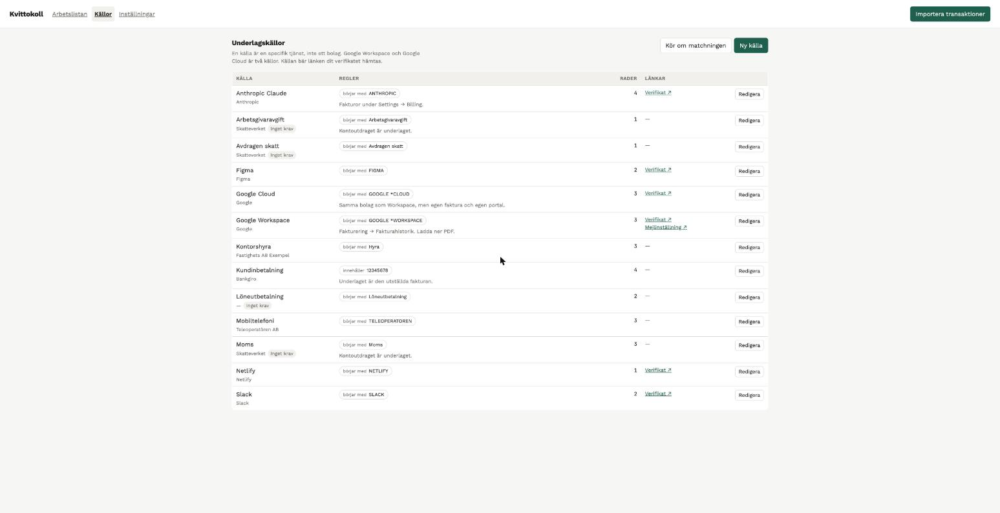
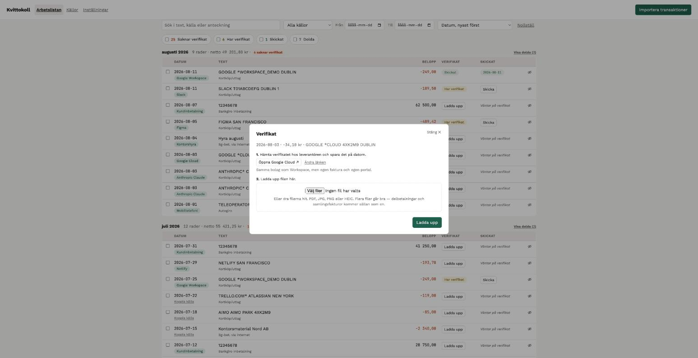

# Kvittokoll

Lokalt verktyg för att stämma av banktransaktioner mot verifikat.

All data ligger på din dator. Ingen server, inget konto, ingen databas — JSON-filer
och en webbapp mot `localhost`.

> Verktyget används dagligen mot skarp bankdata. Massutskick (flera verifikat
> i ett mejl) och SMTP är inte byggda — se [Vad som saknas](#vad-som-saknas). Se [Vad som saknas](#vad-som-saknas).



## Kom igång

```bash
python3 app.py
```

Webbläsaren öppnas mot `http://127.0.0.1:8420/`. Inga beroenden utanför
standardbiblioteket, inget `pip install`, inget byggsteg.

```bash
python3 app.py --port 8421 --no-browser   # annan port, öppna själv
python3 -m unittest discover -s tests -t tests   # kör testerna
```

Ingen konfiguration behövs för att komma igång. Adress till bokföringens
inkorg och mallar ställs in under **Inställningar** i verktyget, som skriver
`settings.json` åt dig. `settings.example.json` visar alla fält och deras
standardvärden.

### Prova utan din egen bank

```bash
cp demo/sources.json data/sources.json
python3 app.py
```

Importera sedan `demo/transaktioner-demo.csv`. Det är påhittade transaktioner
i Swedbanks exportformat, med källor som redan matchar dem. Se
[demo/README.md](demo/README.md).

## Så används det

1. Exportera transaktioner från internetbanken som CSV eller camt.053-XML.
2. **Importera transaktioner** → välj fil → förhandsgranska → bekräfta.
3. Dölj rader som inte kräver verifikat med det överstrukna ögat längst till
   höger. De försvinner ur arbetslistan men finns kvar — **Visa dolda (4)** står
   högerställt på månadsraden när månaden har dolda rader.
4. Koppla rader till underlagskällor. Källan bär länken dit verifikatet hämtas.
5. Klicka **Ladda upp** i verifikatkolumnen. Modalen visar källans länk — öppna
   den, logga in, ladda hem filen, och ladda upp den. Du kan också dra filen
   direkt på raden.
6. Klicka **Skicka**. Verktyget skapar en `.eml` med verifikatet bifogat och
   öppnar den i din mejlklient. Du trycker skicka, och markerar raden som
   skickad.

Adresser, mallar och sökvägar finns under **Inställningar**.

Statushinkarna under filterraden är räknare och filter i ett: *119 Saknar
verifikat*, *10 Har verifikat*, *0 Skickat*, *0 Dolda*. Kryssa i en eller flera
för att begränsa listan — ingen ikryssad betyder allt. Siffrorna räknas på de
rader som klarar övriga filter, så de visar vad ett klick faktiskt skulle ge.

Varje rad visar sin källa som en pill under datumet. Saknas källa står det
**Koppla källa** där istället — aldrig båda, så raden håller sig smal.
Verifikatkolumnen fungerar likadant: **Ladda upp** när verifikatet saknas,
annars en klickbar statusbadge. Skickat-kolumnen med: *Väntar på verifikat*
tills det finns något att bifoga, sedan **Skicka**, sedan datumet. Under
**Källor** i toppen redigerar du namn, länkar, verifikattyp och mönster, och
ser hur många transaktioner varje källa fångar.

Importen är additiv. Den lägger bara till rader — den ändrar aldrig en status,
tar aldrig bort något och rör aldrig ett verifikat du redan laddat upp. Före
varje import tas en kopia av `data/transactions.json` till `data/backups/`.

## Import

### camt.053 (XML)

ISO 20022-kontoutdrag parsas direkt, utan profil. Belopp och tecken läses ur
`Amt` och `CdtDbtInd`, referenstexten ur `RmtInf/Ustrd`, `AddtlNtryInf` eller
motpartens namn — i den ordningen, beroende på vad banken fyller i.

### CSV

CSV kräver en importprofil, eftersom kolumnnamn, avgränsare, teckenkodning,
datumformat och decimaltecken skiljer sig åt mellan banker. Profiler ligger i
`profiles/` som JSON. `profiles/swedbank.json` följer med.

Kolumnmappningen tar antingen ett kolumnnamn eller en mall:

```json
"columns": {
  "date": "Bokfdag",
  "description": "Referens",
  "amount": "Belopp",
  "account": "{Produkt} {Clnr}-{Kontonr}"
}
```

Mallformen finns för att verkligheten sällan lägger ett fält i exakt en kolumn.
Swedbank delar upp kontot i clearingnummer, kontonummer och produktnamn.

Väljer du ingen profil provas alla tills en har alla obligatoriska kolumner.

### Rader som inte går att tolka

De kastas aldrig tyst. Förhandsgranskningen listar dem med radnummer och orsak.
Bekräftar du importen hoppas de över; inget skrivs för dem.

## Dubbletter

Bankexporter saknar oftast ett stabilt transaktions-ID. Swedbanks `Radnr` är
bara radens plats i just den exportfilen. Nyckeln byggs därför av innehållet:

```
datum | belopp | normaliserad text | löpnummer
```

Löpnumret finns för att samma belopp kan dras hos samma källa två gånger samma
dag. Importen räknar förekomster i den nya filen, räknar hur många som redan
finns lagrade, och lägger till differensen. Två identiska köp samma dag ger två
rader. Att importera om samma fil ger noll nya.

Levererar banken ett eget unikt ID används det istället — via `transaction_id`
i profilen eller `AcctSvcrRef` i camt.053.

## Underlagskällor



Entiteten är en **underlagskälla** — en specifik tjänst eller ett abonnemang,
inte ett bolag. Google Workspace och Google Cloud är två källor med olika
portaler och olika fakturor, trots att banktexten är snarlik. Bolaget finns med
som fält för gruppering, men styr ingenting.

### Källor som inte kräver verifikat

Moms, skatt, löner och överföringar mellan egna konton behöver inget underlag —
kontoutdraget är underlaget. Stäng av **Kräver verifikat** på källan, så döljs
alla dess rader ur arbetslistan, får en grå *Inget krav*-markering och räknas
inte som saknade.

Ändringen gäller källans alla rader, inte bara nya. Rader som kopplas till
källan senare ärver kravet. Att spara källan utan att röra kryssrutan ändrar
ingenting — annars hade varje redigering nollställt val du gjort på enskilda
rader.

### Matchningsmönster

Varje mönster har ett läge:

| Läge | JSON | Betyder |
|---|---|---|
| innehåller | `contains` (standard) | texten finns någonstans i transaktionstexten |
| börjar med | `starts_with` | transaktionstexten inleds med texten |
| slutar med | `ends_with` | transaktionstexten avslutas med texten |

Lägena finns för att `innehåller` ibland är för trubbigt. `börjar med HYRA`
fångar `Hyra Kontorsgatan 5` men inte `Bilhyra Stockholm` eller
`Avser hyra april`.

I `sources.json` skrivs det vanliga fallet som en enkel sträng och de
förankrade som objekt, så att filen förblir handredigerbar:

```json
"match_patterns": [
  "GOOGLE *WORKSPACE",
  { "pattern": "HYRA", "mode": "starts_with" }
]
```

Mönstret och transaktionstexten normaliseras på samma sätt innan matchningen —
versaler, borttagna skiljetecken, kollapsade mellanslag — så `GOOGLE *WORKSPACE`
träffar banktexten `Google Workspace_ab Dublin`, och en förankring sitter i
början av den normaliserade texten, inte efter ett skiljetecken.

Mönstret är text, inte ett reguljärt uttryck. Skriver du `A.*B` matchar det
tecknen `A.*B`, inte "A följt av vad som helst följt av B".

Längre mönster har företräde. Är två lika långa vinner det förankrade —
`börjar med HYRA` är mer specifikt än `innehåller HYRA`. Är även det lika
kopplas raden inte automatiskt, utan flaggas som tvetydig.

När du kopplar en rad visar dialogen källans nuvarande regler, och föreslår ett
nytt mönster bara om ingen av dem redan träffar raden. Annars samlar källan på
sig `Hyra juni`, `Hyra juli`, `Hyra augusti` — trots att `börjar med Hyra`
täcker dem alla. Provningen körs medan du skriver och visar hur många av dina
transaktioner mönstret träffar, så att valet av läge inte blir en gissning.

Att spara en källa kör matchningen direkt. En regel som inte kopplar några
rader är bara en text.

Rader som matchats automatiskt kan rättas av en bättre regel: lägger du till en
mer specifik källa senare tar den över. Rader du kopplat **själv** rörs aldrig —
matchningen skiljer på sin egen gissning och ditt beslut. En koppling tas heller
aldrig bort av matchningen; att en regel ändras får inte tömma en rad som redan
hittat hem.

## Filer

```
app.py                  starta appen
kvittokoll/             logiken
  storage.py            atomiska skrivningar, backup, papperskorg
  dedupe.py             dubblettnyckeln
  sources.py            källmatchning
  receipts.py           uppladdning och namnstandard
  mail.py               .eml-generering
  importer.py           förhandsgranska → bekräfta
  importers/            camt.053, CSV, profiler
  api.py                API-lagret, vet inget om HTTP
  server.py             HTTP, standardbiblioteket
docs/bilder/            skärmdumpar till den här filen
static/                 gränssnittet, vanilla JS
  fonts/                Work Sans och JetBrains Mono, self-hostade
profiles/               importprofiler
demo/                   påhittad data att prova med
data/                   din data — ligger i .gitignore
  transactions.json
  sources.json
  receipts/ÅÅÅÅ-MM/     uppladdade verifikat
  outbox/               skapade .eml-filer
  backups/
  trash/
```

`data/`, `receipts/` och `settings.json` ligger i `.gitignore`. Ingen av dina
transaktioner hamnar av misstag i ett publikt repo.

## Verifikat



Verktyget kan inte hämta verifikatet åt dig — det ligger bakom leverantörens
inloggning. Källans `receipt_url` är därför en genväg, inte en nedladdning: den
öppnas i en ny flik så att du slipper leta upp sidan varje gång, och källans
anteckning beskriver sista biten av vägen dit.

När du öppnar filväljaren lägger sig systemets fönster mitt på skärmen och
täcker rutan. Därför tänds en rad högst upp — *Letar efter: Kvitto från Google
CLOUD · 7,17 kr · 2026-05-04* — som blir kvar tills du valt en fil. Annars får
man stänga allt för att komma ihåg vilket kvitto man letade efter.

Saknar källan länk går den att lägga till direkt i uppladdningsrutan, utan att
gå omvägen via Källor. Den sparas på källan och gäller därmed alla dess köp.
Skriver du en adress utan `https://` läggs det på — annars blir länken relativ
och leder fel.

Filen du laddar upp **kopieras** in under `data/receipts/ÅÅÅÅ-MM/` så att den
överlever att nedladdningsmappen töms. Originalfilen lämnas orörd och
originalnamnet sparas.

### Namnstandard

```
{date}_{amount}_{tag}.{ext}     →  2026-03-14_449-00_google-workspace.pdf
```

Beloppet skrivs med bindestreck som decimaltecken och utan minustecken. Punkt
duger inte — den läses som en filändelse och är dessutom fel decimaltecken på
svenska. Komma duger inte heller: det bråkar med CSV och skalkommandon.
Minustecknet utelämnas eftersom det fungerar dåligt i filnamn på vissa system,
och tecknet framgår ändå av transaktionen. `{tag}` kommer från källans `filename_tag`; saknas
källa används transaktionstexten, gemener, bindestreck, max 40 tecken, utan
å/ä/ö. Vid namnkollision läggs `-2`, `-3` till.

Mallen ändras med `filename_template` i `settings.json`. Platshållare:
`{date}`, `{amount}`, `{tag}`, `{company}`, `{account}`. Blir en platshållare
tom dras dubbla avgränsare ihop, så `{date}_{company}_{tag}` utan bolag ger
`2026-03-14_google-workspace` och inte `2026-03-14__google-workspace`.

### Vad som kontrolleras

PDF, JPG, PNG och HEIC accepteras, och **innehållet** kontrolleras — inte bara
filändelsen. Det vanligaste misslyckandet när man hämtar verifikat bakom
inloggning är att man inte var inloggad och fick en HTML-sida som heter
`faktura.pdf`. Den avvisas med besked om vad som hänt, i stället för att
upptäckas av bokföraren en månad senare.

### Flera verifikat per transaktion

En rad kan bära flera filer. Delbetalningar och samlingsfakturor kommer sällan
som en enda PDF. Välj eller dra flera filer på en gång — de läggs till, inget
skrivs över.

Finns redan verifikat visas de i stället för uppladdningsrutan: en flik per fil
och den valda renderad i fönstret. **Lägg till fler filer** är den primära
åtgärden och fäller ut uppladdningen igen. Under förhandsvisningen står filens
namn med *Öppna i ny flik* och *Ta bort fil N* bredvid — åtgärderna sitter hos
filen de gäller. Filer raderas aldrig, de flyttas till `data/trash/`.

Flikarna visar bara den del av namnet som skiljer filerna åt. Underlag från
samma leverantör delar nästan hela namnet — `Bg5547-4688_Detalj_Ref20336_…`
mot `Bg5547-4688_Detalj_Ref_…` — och vilken ände man än klipper ser de likadana
ut. Kan ingen del skilja dem gäller ordningstalet.

Filerna delar namnstomme och skiljs åt av krocksuffixet:
`2026-03-14_449-00_google-workspace.pdf`, `…-2.pdf`, `…-3.pdf`.

Att lägga till eller ta bort en fil nollställer **Skickat**. Det som skickades
stämmer inte längre överens med underlaget, så raden hamnar tillbaka i kön.

Alla filer på raden bifogas samma mejl.

## Utskick

`mailto:` kan inte bifoga filer, och SMTP skulle kräva att du lägger ett
app-lösenord i en konfigfil. Därför `.eml`: verktyget skriver en komplett
mejlfil till `data/outbox/` och öppnar den i din mejlklient med bilagan redan på
plats. Du trycker skicka.

Ämnesrad och brödtext byggs av mallarna i `settings.json`, med platshållarna
`{date}`, `{amount}`, `{source}`, `{company}` och `{account}`. Beloppet behåller
sitt tecken här — en inbetalning och en utgift ska inte se likadana ut i
ämnesraden.

Mottagaradressen ställs in en gång under **Inställningar** och används för
alla utskick. Avsändaren är valfri: mejlet skickas från kontot i din
mejlklient oavsett vad som står i filen. Har du flera konton är det däremot
`From` som avgör vilket klienten väljer — då är den värd att fylla i.

I Apple Mail öppnas en `.eml` som ett *läst* meddelande utan Skicka-knapp.
Tryck **⇧⌘D** (Meddelande → Skicka igen) för att få ett utkast med bilagan
kvar, som går att skicka. Verktyget påminner om det efter att filen skapats.

**Verktyget vet inte om mejlet gick iväg.** Det kan bara skapa filen och öppna
den. Därför markerar du raden som skickad i ett eget steg, efteråt. Att en rad
står som skickad betyder att du sa att den var det.

Massutskick (§8.4 i kravspecen) och SMTP som alternativ är inte byggda.

## Typsnitt

Work Sans för text, JetBrains Mono för belopp, datum och antal — siffror som
ska gå att jämföra kolumnvis mår bra av att vara lika breda.

Båda ligger i `static/fonts/` istället för att hämtas från Google Fonts CDN, så
att verktyget fungerar utan internet och inte skickar en förfrågan till en
tredje part varje gång du öppnar din bokföring. Cirka 158 kB, SIL OFL 1.1. Se
`static/fonts/README.md`.

## Begränsningar

Verktyget **bokför ingenting**. Det integrerar inte mot något bokföringssystem
och ersätter inte bokföraren. Det är en avstämningslista med minne.

Det kan inte heller veta vad bokföringssystemet faktiskt tagit emot. Att en rad
är markerad som skickad betyder att du markerade den som skickad.

Servern binder mot `127.0.0.1` och har ingen inloggning. Kör den inte mot en
adress som andra kan nå.

## Vad som saknas

Byggt: datamodell med atomiska skrivningar, import av camt.053 och CSV,
dubblettlogik, arbetslistan med statusar, kräver-verifikat-växlare,
källregistret med matchning, koppling och redigerbar källvy, uppladdning av
verifikat med namnstandard, `.eml`-utskick per rad och inställningsvy.

Inte byggt ännu: massutskick (§8.4) och SMTP som alternativ till `.eml`.

## Krav

Python 3.9 eller senare. Inga andra beroenden.

## Licens

MIT.
